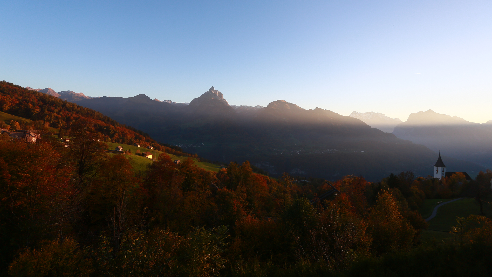

# The **Beauty** of _CSS_ design is [here](#)

{:class="img-responsive"}

A demonstration of what can be accomplished through CSS-based design. Select any style sheet from the list to load it into this page.

Meet me on [XING](https://www.xing.com/profile/Frank_Nocke?keywords=frank+nocke+web+entwickler+frontend), [Github&thinsp;](https://github.com/nocke) or [StackOverflow&thinsp;](https://stackoverflow.com/users/444255/frank-nocke?tab=topactivity).

## The Road to enlightenment
Littering a dark and dreary road lay the past relics of browser-specific tags, incompatible DOMs, broken CSS support, and abandoned browsers.

We must clear the mind of the past. Web enlightenment has been achieved thanks to the tireless efforts of folk like the W3C, WaSP, and the major browser creators.

The CSS Zen Garden invites you to relax and meditate on the important lessons of the masters. Begin to see with clarity. Learn to use the time-honored techniques in new and invigorating fashion. Become one with the web.

## So What ist this about?

There is a continuing need to show the power of CSS. The Zen Garden aims to excite, inspire, and encourage participation. To begin, view some of the existing designs in the list. Clicking on any one will load the style sheet into this very page. The HTML remains the same, the only thing that has changed is the external CSS file. Yes, really.
